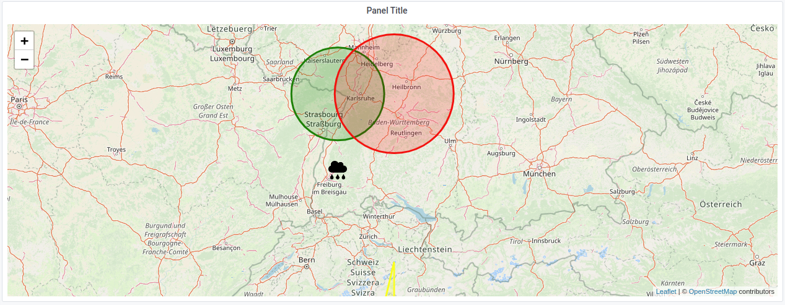

# Grafana Special Map plugin

[](https://github.com/KWMSys/GrafanaSpecialMapPanel/actions?query=workflow%3A%22CI%22)

A map panel plugin which allows custom displayment of data on a map by providing a JSON endpoint. Layout of JSON is similar to leaflet options.

__GRAFANA DATASOURCES ARE NOT SUPPORTED__
(Json Datasource plugin could be accessed by using the grafana datasource proxy)

## Example



For more information about panels, refer to the documentation on [Panels](https://grafana.com/docs/grafana/latest/features/panels/panels/)

## JSON endpoint layout

### Layout

All keys defined in `layout` will be applied to the map.

A.e. if you dont set the zoom on the first request to 6 and dont want to change the zoom on a timerange change, you have to remove zoom from the layout on the next request.
You could use the `firstRequest` query param to check if it is the first request and only then apply the zoom.
```json
{
   "layout":{
      "center":{
         "lat":49,
         "lng":8
      },
      "zoom":6
   },
   ...
}
```

### Data
Like shown in the example below, you can create markers, circles and more.

* Each object must have an unique `id`.
* `tooltip` and `popup` are optional
* `data.options` is nearly the same as the `options` object of leaflet
* `data.type` is required and currently there are `circle, marker, circle_marker polygon and polyline`
* `data` layout depends on the `data.type` (Interfaces are below)

### Example

```json
{
   "layout":{
      "center":{
         "lat":49,
         "lng":8
      },
      "zoom":6
   },
   "data":[
      {
         "id":0,
         "tooltip":{
            "content":"<span style=\"color: red;\">HTML SUPPORT</span> available"
         },
         "data":{
            "type":"circle",
            "lat":50,
            "lng":10,
            "options":{
               "radius":20000,
               "color":"blue"
            }
         }
      },
      {
         "id":1,
         "tooltip":{
            "content":"Tooltip",
            "options":{
               "direction":"top"
            }
         },
         "data":{
            "type":"circle",
            "lat":49,
            "lng":8,
            "options":{
               "radius":60444.36457401041,
               "color":"green"
            }
         }
      },
      {
         "id":2,
         "popup":{
            "content":"Some PopUp"
         },
         "data":{
            "type":"circle",
            "lat":49,
            "lng":9,
            "options":{
               "radius":77158.81345856893,
               "color":"red"
            }
         }
      },
      {
         "id":3,
         "tooltip":{
            "content":"Marker tooltip"
         },
         "data":{
            "type":"marker",
            "lat":48,
            "lng":8,
            "options":{
               "icon":{
                  "iconUrl":"data:image/png;base64,iVBORw0KGgoAAAANSUhE....",
                  "iconSize":[
                     30,
                     30
                  ],
                  "iconAnchor":[
                     15,
                     30
                  ]
               },
               "title":"Hello marker!"
            }
         }
      },
      {
         "id":4,
         "tooltip":{
            "content":"Polygon "
         },
         "data":{
            "type":"polygon",
            "points":[
               {
                  "lat":43,
                  "lng":8
               },
               {
                  "lat":44,
                  "lng":8
               },
               {
                  "lat":47,
                  "lng":9
               },
               {
                  "lat":43,
                  "lng":9
               }
            ],
            "options":{
               "color":"yellow"
            }
         }
      },
      {
         "id":5,
         "tooltip":{
            "content":"Polyline"
         },
         "data":{
            "type":"polyline",
            "points":[
               {
                  "lat":50,
                  "lng":8
               },
               {
                  "lat":51,
                  "lng":8
               },
               {
                  "lat":52,
                  "lng":9
               },
               {
                  "lat":50,
                  "lng":9
               }
            ],
            "options":{
               "color":"cyan"
            }
         }
      }
   ]
}
```

### Interfaces
#### Datapoint
```ts
export interface DataPoint {
  id: number;
  tooltip?: TooltipDataPointExtension;
  popup?: PopupDataPointExtension;
  data: CircleDataPoint | MarkerDataPoint | PolygonDataPoint | PolylineDataPoint;
}
```
#### Data of Datapoint
```ts

export interface CircleDataPoint {
  type: DataPointType.Circle | DataPointType.CircleMarker;
  lat: number;
  lng: number;
  options?: Leaf.CircleMarkerOptions;
}

export interface PolygonDataPoint {
  type: DataPointType.Polygon;
  points: Array<{
    lat: number;
    lng: number;
  }>;
  options?: Leaf.PolylineOptions;
}

export interface PolylineDataPoint {
  type: DataPointType.Polyline;
  points: Array<{
    lat: number;
    lng: number;
  }>;
  options?: Leaf.PolylineOptions;
}

export interface MarkerDataPoint {
  type: DataPointType.Marker;
  lat: number;
  lng: number;
  options?: Leaf.MarkerOptions & {
    icon?: Leaf.IconOptions;
  };
}
```